# Preparación

Necesitamos tener instalados los paquetes `ggplot2` y `qvalue` en R. En la carpeta de trabajo encontraréis también los datos necesarios.

```{r}
install.packages("ggplot2")

#Para compobar que está instalado correctamente 
library("ggplot2")
```

Para instalar qvalue es más complejo, ya que no está en CRAN, sino en Bioconductor, por tanto, primero comprueba si está instalado el Bioconductor y, si no lo está, lo descarga y ya luego descarga el qvalue.

```{r}
if (!require("BiocManager", quietly = TRUE))     
install.packages("BiocManager")  

BiocManager::install("qvalue")

#Para comprobar que está instalado:
library("qvalue")
```

# Objetivos

1.  Practicar la representación gráfica de datos con `ggplot2`.
2.  Aprender lo que es una gráfica volcán y una gráfica de Manhattan.
3.  Demostrar que la exploración gráfica puede ayudarnos a comprender los datos.

# Datos

En esta sesión, trabajaremos con los resultados de un análisis de asociación genómica entre un fenotipo cuantitativo y los genotipos de 195 peces en 11746 posiciones variables o SNPs de su genoma. El archivo `gwas.txt` ha sido obtenido con el programa [PLINK2](https://www.cog-genomics.org/plink/2.0/) [@Purcell2007; @Chang2015]. Contiene 16 columnas, descritas a continuación y también [en este enlace](https://www.cog-genomics.org/plink/2.0/formats#glm_linear):

-   **CHROM**, **POS**, **ID**: cromosoma, posición e identificador del SNP.
-   **REF**: alelo de referencia.
-   **ALT**: alelo alternativo.
-   **PROVISIONAL_REF.**: indica si el alelo de referencia es provisional o no.
-   **A1**: alelo cuya dosis se usa en la regresión como variable independiente.
-   **OMITTED**: el otro alelo.
-   **A1_FREQ**: frecuencia del alelo A1 en la población.
-   **TEST**: test estadístico aplicado. *ADD*: el efecto aditivo del alelo A1 es nulo.
-   **OBS_CT**: tamaño muestral (número de individuos) en la regresión.
-   **BETA**: coeficiente de regresión estimado para el alelo A1.
-   **SE**: error estándar del coeficiente de regresión.
-   **T_STAT**: estadístico *T*.
-   **P**: valor *p* del estadístico.
-   **ERRCODE**: código de error, si lo hay, o bien "." (sin error).

Cargamos los datos en una sesión de R para empezar a explorarlos, y activamos el paquete `ggplot2`, que usaremos después.

```{r}
library('ggplot2')
gwas <- read.table('gwas.txt')
```

::: {.callout-note icon="false"}
## Desafío

La orden `read.table('gwas.txt')` no da error, pero es errónea. ¿Puedes arreglarla?

El comando completo para utilizarlo y que funcione correctamente es el siguiente:

```{r}
gwas <- read.table('gwas.txt', header = TRUE, sep = "\t")
```

Se necesita poner header = TRUE para decirle al R que en la primera línea del archivo están los nombres de la columna y sep = "\\t" específica que los datos están separados por tabuladores.

Es necesario poner estas dos cosas porque si no, no le estamos diciendo a R cómo está estructura el archivo, por lo que asume que la primera línea del archivo no es el nombre de las columnas y los datos están separados por espacios en blanco, lo cual no es correcto.
:::

# Comprobar las suposiciones

Sabemos que el estadístico *T* es la relación entre la diferencia del valor estimado de un parámetro ($\beta$) respecto su valor asumido (0) y el error estándar de la estimación. Comprobémoslo con `ggplot()`:

```{r}
ggplot(data = gwas,
       mapping = aes(x = BETA / SE, y = T_STAT)) +
   geom_point() + 
   geom_abline(intercept = 0, slope = 1, color = 'red')
```

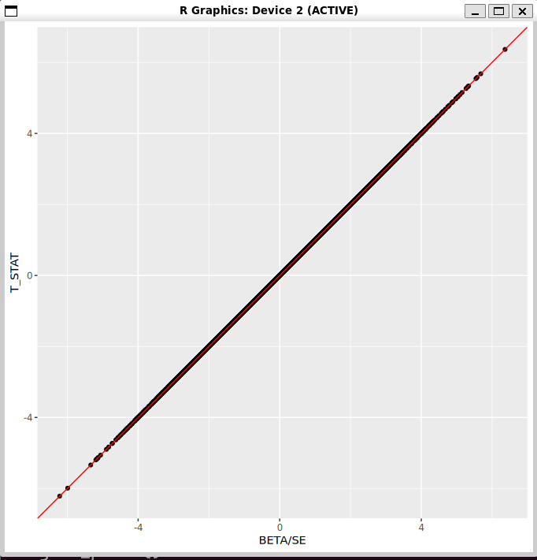

:::: {.callout-note icon="false"}
## Desafío

Comprueba gráficamente las suposiciones siguientes. Esfuérzate por imaginar qué forma esperas que adopte la gráfica en cada caso antes de representarla. Si en algún caso encuentras una relación diferente a la esperada, trata de explicarte por qué.

1.  El valor *p* sólo depende del estadístico *T*.

Como el valor de p se calcula a partir del estadístico T y los grados de libertad, esperaríamos una relación no lineal, donde a mayor valor de T (en valor absoluto) menor valor de p.

Este es el comando a utilizar:

```{r}
ggplot(data = gwas, mapping = aes(x = T_STAT, y = P)) + 
  geom_point()
```

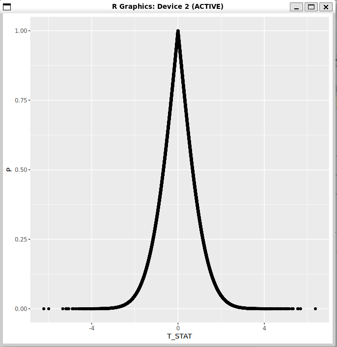

Tiene esta forma porque T va en función al p-valor, por lo que cuanto más se acerque a 0 el test de la T, más alto es el p-valor, por lo que más cosas se dejan al azar.

A mayor p-valor, menos seguridad en el test estadístico.

2.  El alelo A1 es siempre el que tiene la frecuencia más baja, en estos datos.

Con esta suposición, suponemos que el alelo A1 es el que tiene menor frecuencia, por lo que todos los valores deberían estar entre 0 y 0,5 para aceptar la hipotesis.

Realizando el siguiente comando:

::: {.callout-note icon="false"}
```{r}
ggplot(data = gwas, mapping = aes(x = T_STAT, y = A1)) +
  geom_point()
```

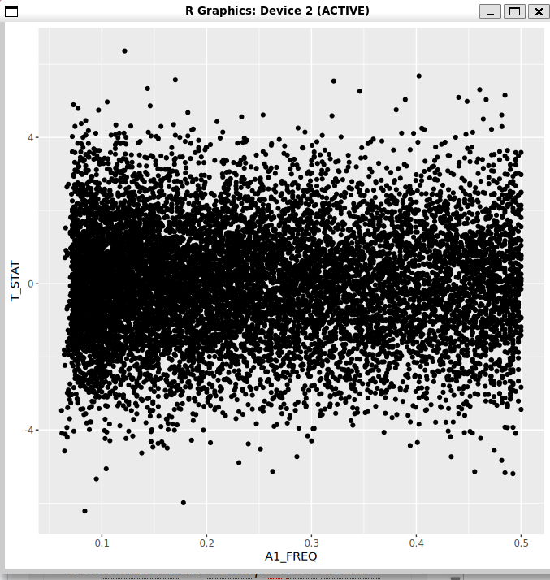

Podemos observar que los valores no son superiores a 0,5, por lo que se acepta la hipótesis.

3.  El error estándar es menor cuanto mayor es el tamaño muestral.

En este caso hay que comparar el tamaño muestral (que es OBS_CT) y el error estándar (SE). Se realiza una gráfica y habrá que comprobar cuales son los valores. El comando utilizado es el siguiente:

```{r}
ggplot(data = gwas, mapping = aes(x = OBS_CT, y = SE)) +
  geom_point()


```

\
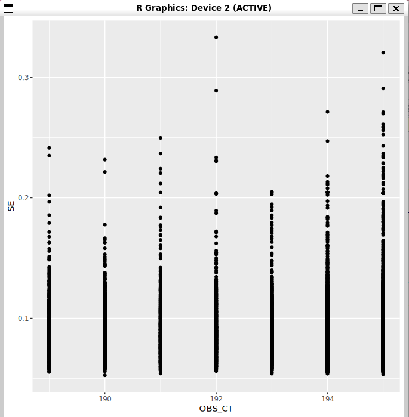

No es evidente que haya una relación negativa entre el número de individuos y el error estándar.

4.  La distribución de valores *p* se hace uniforme hacia la derecha.

Con el siguiente comando (cambiando el gráfico de puntos por un histograma), se obtiene lo sigueinte:

```{r}
ggplot(data = gwas, mapping = aes(x = P)) + 
  geom_histogram(bins = 30)
```

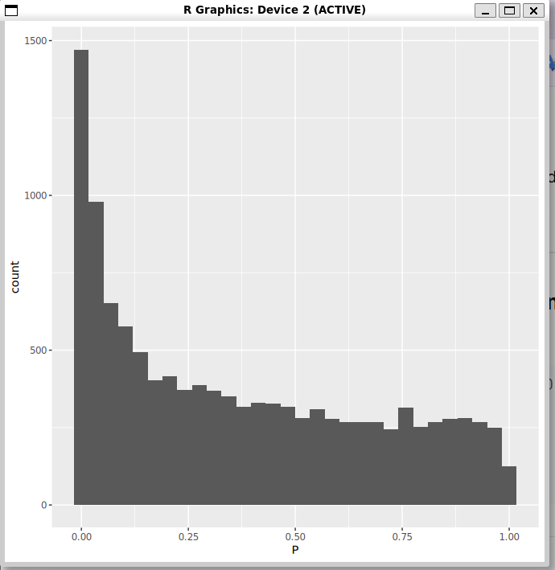
:::
::::

# Agrupación de datos

Podemos mapear una variable categórica a un estético como el color, el tipo de línea o la forma del punto, para representar datos de diferentes categorías separadamente. A continuación usamos el color para resumir la relación entre frecuencia alélica y error estándar del estadístico, según el número de individuos utilizados.

```{r}
# OBS_CT no es categórica, pero la tratamos como tal con "factor()".
# Observa que el color aquí se mapea sólo en la capa "geom_smooth()",
# para que los puntos sean todos negros.
ggplot(data = gwas,
       mapping = aes(x = A1_FREQ, y = SE)) +
   geom_point() +
   geom_smooth(mapping = aes(color = factor(OBS_CT)), se = FALSE)
```

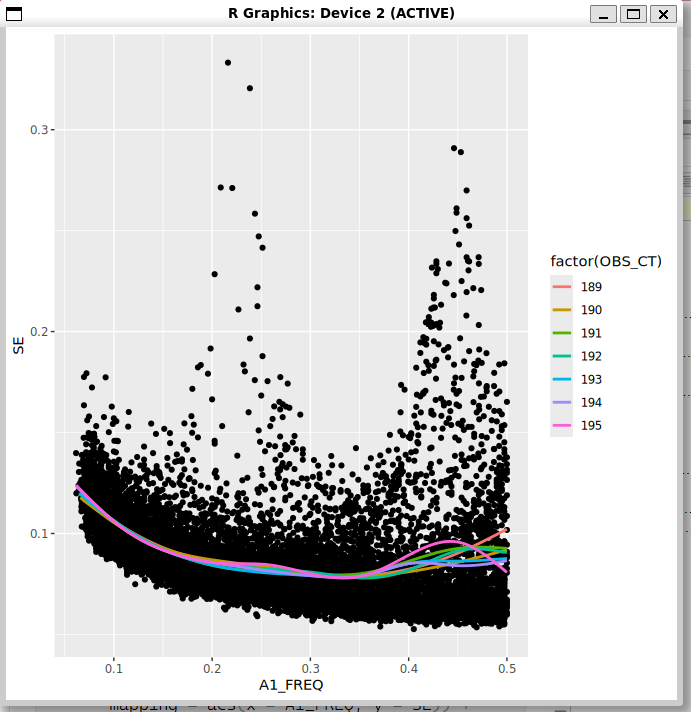

En la gráfica aparece la frecuencia del alelo A1 con respecto al error estándar y las distintas muestras. Como ningún valor supera 0,5, todos los valores son significativos y el error es bajo.

Otra forma de agrupar los datos es mediante las *facetas*:

```{r}
#| fig.width: 10
#| fig.height: 10

ggplot(data = gwas,
       mapping = aes(x = A1_FREQ, y = SE)) +
   geom_point() +
   facet_wrap(~CHROM, scale = 'free')
```

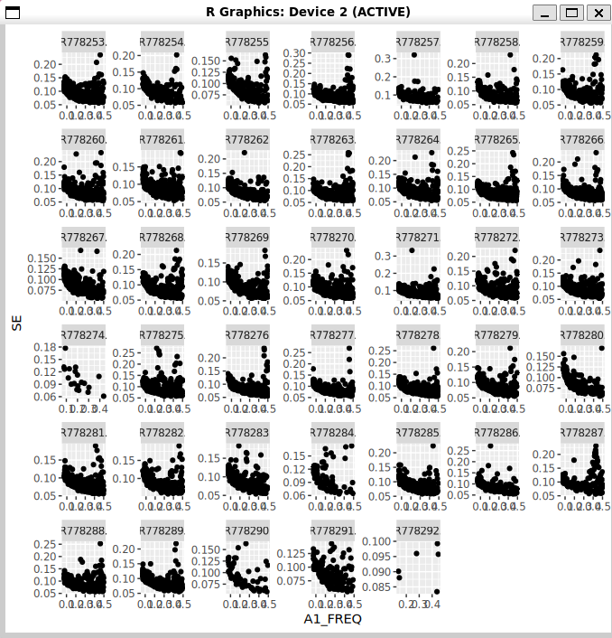

::: {.callout-note icon="false"}
## Desafíos

1.  Haz que no sólo las líneas, sino también los puntos tengan colores diferentes, que correspondan a los valores de OBS_CT, en la gráfica donde has usado `geom_smooth()`.

El código utilizado fue el siguiente:

```{r}
ggplot(data = gwas, mapping = aes(x = A1_FREQ, y = SE)) + 
  geom_point(mapping = aes(color = factor(OBS_CT)), se = FALSE) + 
  geom_smooth(mapping = aes(color = factor(OBS_CT)), se = FALSE)
```

Se añade a geom_point lo mismo que ponía en geom_smooth para que tenga color.

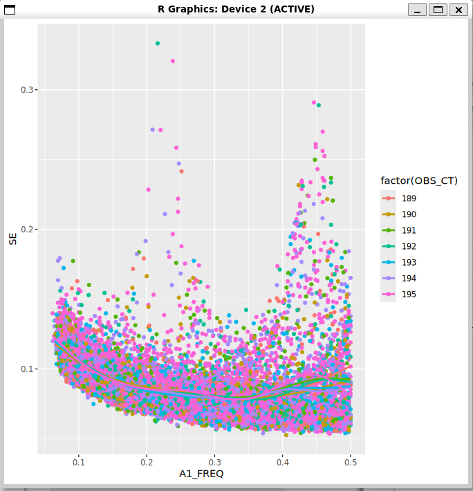

2.  Añade una línea suavizada (`geom_smooth()`) a cada cromosoma en el gráfico anterior.

La gráfica se obtiene con el siguiente comando:

```{r}
ggplot(data = gwas, mapping = aes(x = A1_FREQ, y = SE)) + 
  geom_point(mapping = aes(color = factor(OBS_CT)), se = FALSE) + 
  geom_smooth(mapping = aes(color = factor(CHROM)), se = FALSE)
```

Se cambia en geom_smooth el factor y se pone CHROM.

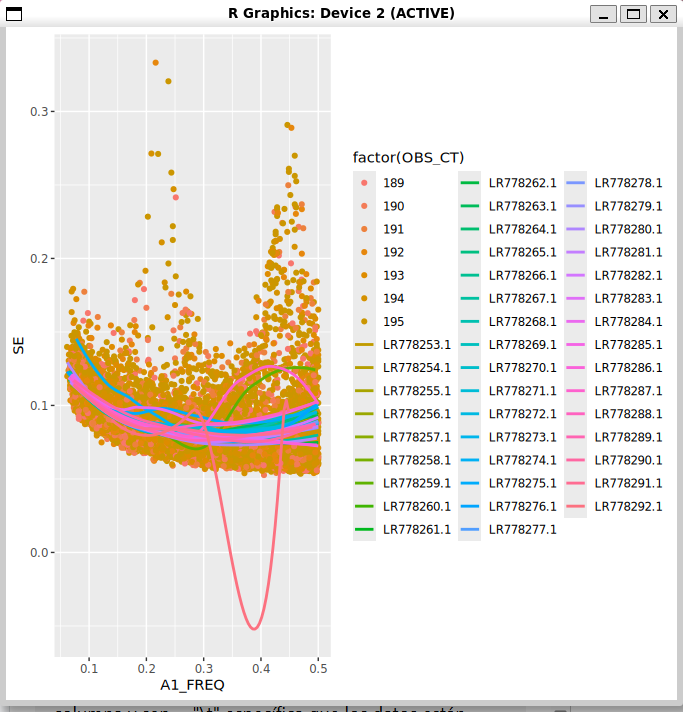

3.  ¿Cómo puedes deshacerte de los mensajes de `geom_smooth()`?

Teóricamente, se pueden eliminar utilizando:

```{r}
#| warning: false

#| message: false
```

4.  ¿Para qué sirve la opción `scale = 'free'` en `facet_wrap()`?

Sirve para que cada faceta pueda tener sus propios límites según los criterios necesarios y aplicables a cada caso.
:::

# Agrupación de datos y estadísticos

Al examinar la relación entre el error estándar y el tamaño muestral, podemos tratar el tamaño muestral como variable categórica, porque tiene sólo 7 valores diferentes. Observa cómo en el bloque siguiente añadimos información sobre la media de cada categoría sin modificar el marco de datos, aprovechando la función `stat_summary()`:

```{r}
ggplot(data = gwas,
       mapping = aes(x = factor(OBS_CT),
                     y = SE)) +
   geom_violin() +
   # Con "group = 1" definimos un único grupo (cualquier valor constante sirve),
   # para que una línea una todos los puntos, en lugar de generar una línea en
   # cada valor de X:
   stat_summary(geom = 'line',
                fun = 'mean',
                group = 1,
                colour = 'gray') +
   # Los puntos, en cambio, son uno para cada grupo:
   stat_summary(geom = 'point',
                fun = 'mean',
                colour = 'red',
                size = 2)
```

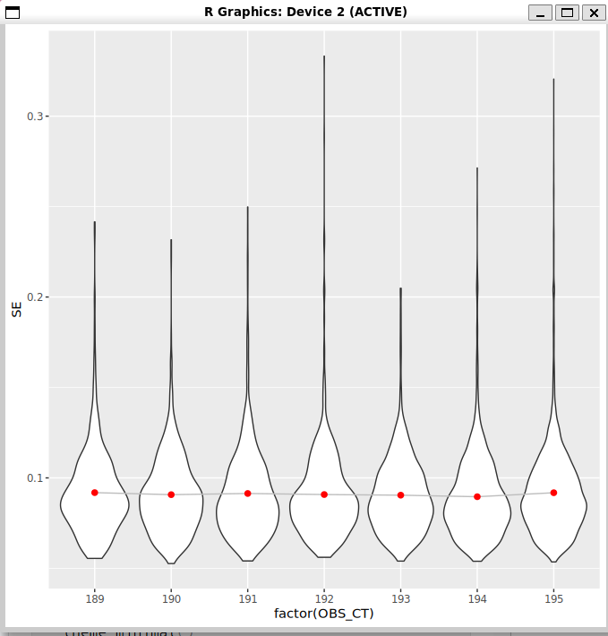

Otra forma de representarlo:

```{r}
ggplot(data = gwas, aes(x = OBS_CT, y = SE)) +
   stat_summary(geom = 'line', fun = 'mean', linewidth = 7, color = 'gray') +
   geom_point(position = 'jitter', size = 0.1) + 
   stat_summary(geom = 'point', fun = 'mean', color = 'red', size = 4) +
   theme_minimal()
```

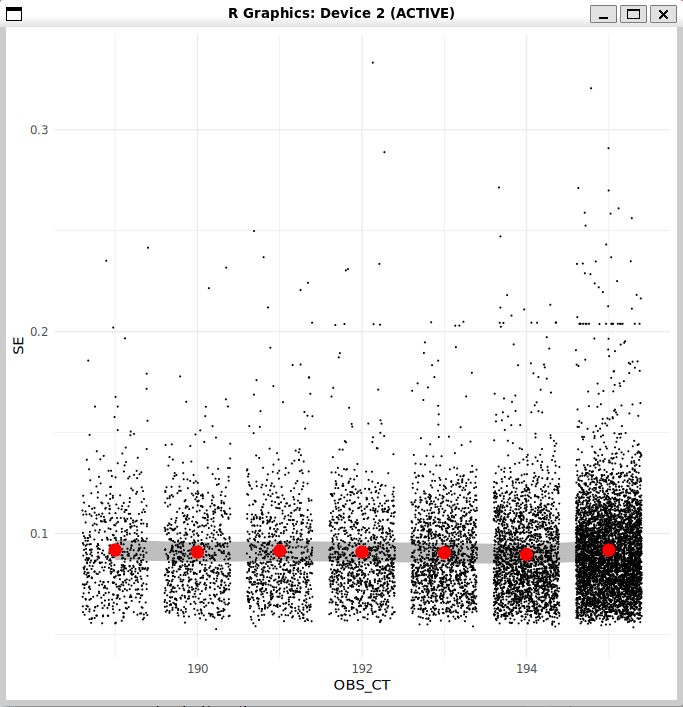

::: {.callout-note icon="false"}
## Desafío

1.  ¿Para qué sirve la opción `position = 'jitter'`?

Añade un pequeño sombreado a los puntos para mostrar la densidad real.

2.  ¿Por qué en la gráfica de violines teníamos que especificar `group = 1` y en la siguiente no, al representar la línea?

Para definir un único grupo, es decir, para que una línea una todos los puntos en lugar de generar una línea en cada valor de X. La diferencia con la otra gráfica es que la X no está definida como un factor, sino como una variable númerica por lo que antes ya nos estaba agrupando los valores respecto a la variable categórica. La línea intenta hacer una línea diferente para cada grupo, por lo que hay que indicarlo.

3.  ¿Para qué sirve la función `factor()` al representar la gráfica de violines?

Para que salgan un violín por cada agrupación de muestras, no un total.

4.  ¿Se te ocurre alguna otra manera de combinar datos y sus estadísticos (como la media) en un mismo gráfico, sin usar `stat_summary()`? ¿Qué método te gusta más?

Trabajando con el marco de datos general en la que tenemos la media para cada grupo, añadiendo esos datos secundarios al mismo plot dentro del genom_point. Hereda los datos del marco anterior.
:::

# Barras

Si combinamos el alelo A1 con el OMITTED, clasificamos cada SNP en una de las 12 posibles combinaciones de dos nucleótidos diferentes. Podemos representar las frecuencias de los 12 tipos de SNPs con un gráfico de barras. Obsérvalo e intenta explicar el patrón.

```{r}
gwas$ALLELES <- paste0(gwas$A1, gwas$OMITTED)
ggplot(data = gwas, mapping = aes(x = ALLELES)) + geom_bar(stat = 'count')
```

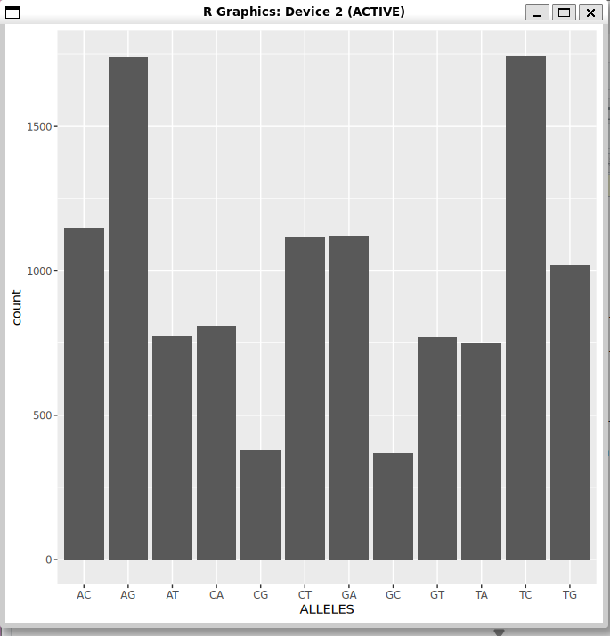

`geom_bar()` automáticamente representa el número de observaciones de cada tipo. Este geométrico usa el estético `fill` para el color de las barras. Podemos mapear una variable categórica a `fill`. Por ejemplo, ahora que tenemos clasificados los SNPs en 12 categorías, veamos cuántos hay de cada tipo en cada cromosoma:

```{r}
ggplot(data = gwas, mapping = aes(x= CHROM, fill = ALLELES)) +
   geom_bar()
```

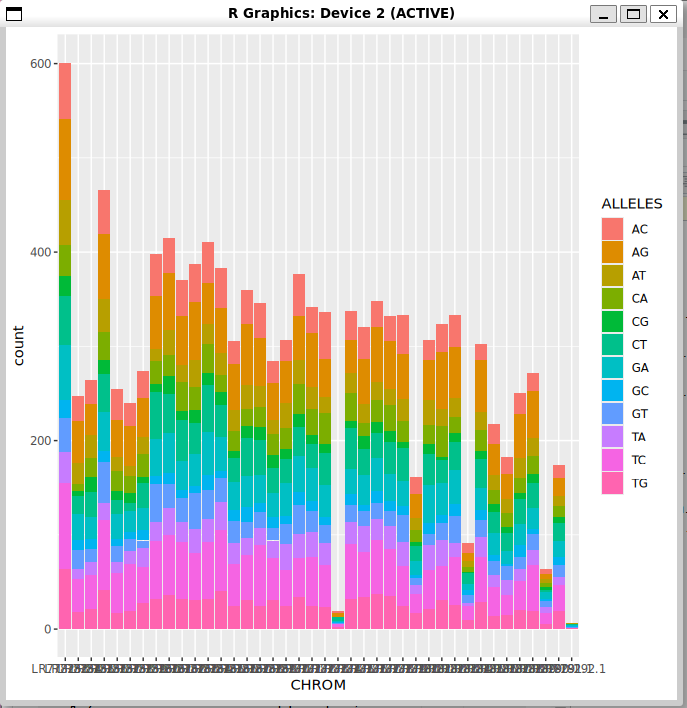

::: {.callout-note icon="false"}
## Desafíos

1.  Genera una nueva variable categórica en `gwas` que indique si el SNP es una transición (AG, GA, CT, TC) o una transversión (los otros) y comprueba con un diagrama de barras si las proporciones son comparables entre cromosomas.

```{r}
#Primero, se crea la variable MUT_TYPE. 
#ifelse es una función que funciona como un condicional (si pasa algo entonces tal, si no). Lo que viene después es la condición. Si es vedad que el valor de ALLELLES está dentro del conjunto AG, GA, CT y TC se pone transición. Si no, se pone tranversión. 
gwas$MUT_TYPE <- ifelse(gwas$ALLELES %in% c("AG", "GA", "CT", "TC"), "transicion", "transversion")

#Esto es para crear el diagrama de barras. Labs es de label, de etiquetas. 
ggplot(data = gwas, mapping = aes(x = factor(CHROM), fill = MUT_TYPE)) + 
  geom_bar(position = "dodge") + 
  labs(x = "Cromosoma", y = "Número de SNPs", fill = "Tipo")
```

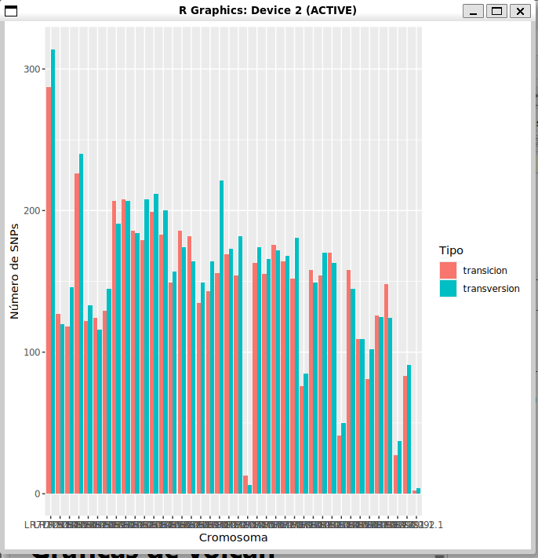

2.  Mira también si existe relación entre el tipo de mutación y la frecuencia alélica.

El comando utilizado fue el sigueinte:

```{r}
ggplot(data = gwas, mapping = aes(x = A1_FREQ, fill = MUT_TYPE)) +
   geom_histogram(bins = 30, alpha = 0.6, position = "identity") +
#Esto es para que se divida el gráfico en paneles separados. ~MUT_TYPE crea un panel para cada valor único de MUT_TYPE. 
   facet_wrap(~MUT_TYPE) +  
   labs(x = "Frecuencia del alelo A1",
        y = "Número de SNPs",
        title = "Distribución de frecuencias: Transiciones vs Transversiones") +
#theme_bw() es para que sea fondo blanco y línea de cuarícula grises. 
   theme_bw() +
#Elimina la leyenda del gráfico. 
   theme(legend.position = "none")
```

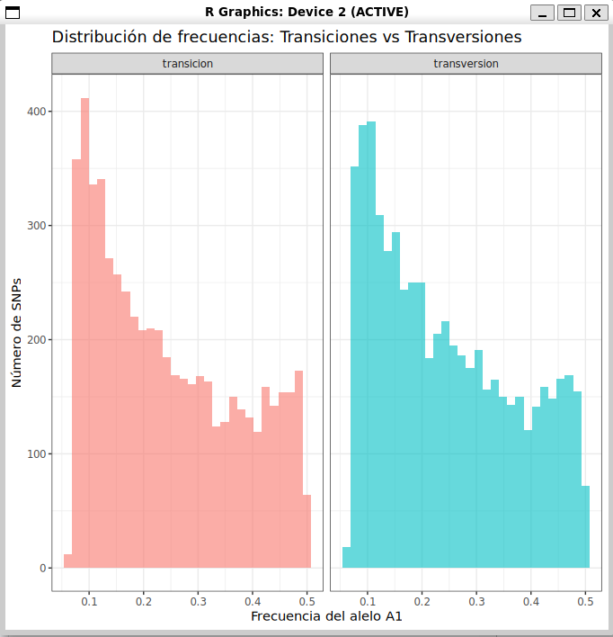
:::

# Gráficas de volcán

Las gráficas de volcán representan simultáneamente la significación de cada resultado (valor *p*) y la magnitud (y el signo) del efecto estimado. Los valores *p* se muestran en escala logarítmica y con el signo cambiado, para que los resultados más significativos destaquen como *mayores*. Podemos añadir algunas líneas que indiquen los umbrales arbitrarios que utilizamos para seleccionar los resultados creíbles, o bien añadir color a los puntos seleccionados como positivos. A la hora de decidir estos umbrales es fundamental conocer la tasa de falsos positivos esperada con cada umbral (FDR). Para ello, añadimos al marco de datos una columna con el valor *q* [^1], calculado con la función `qvalue()` del paquete `qvalue` [@qvalue].

[^1]: El valor *q* de un test es la proporción de falsos positivos que esperamos entre todos los resultados con un valor *p* menor o igual al de ese test.

```{r}
library('qvalue')
gwas$q <- qvalue(gwas$P)$qvalues
ggplot(data = gwas,
       mapping = aes(x = BETA, y = -log(P), color = q)) +
   geom_point() +
   scale_color_gradient(name = 'FDR', trans = 'log',
                        breaks = c(0.001, 0.01, 0.1),
                        low= 'red', high='gray') +
   geom_abline(intercept = -log(max(gwas[gwas$q <= 0.001, 'P'])),
               slope = 0, linewidth = 0.2, linetype = 2, color = 'black') +
   theme_minimal()
```

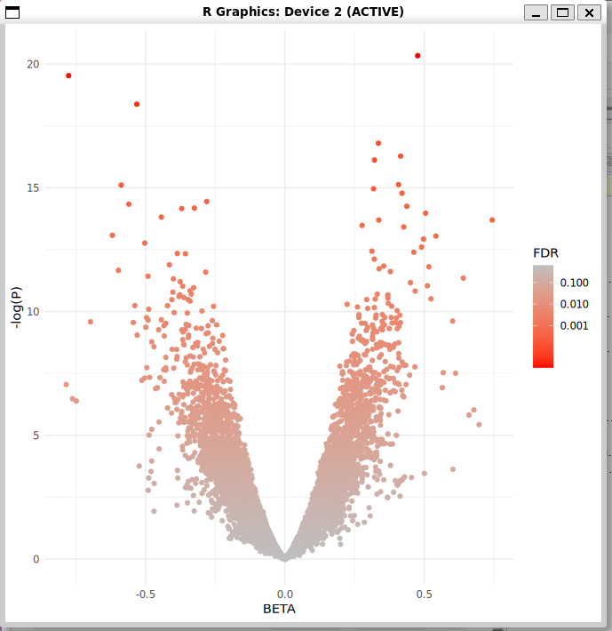

::: {.callout-note icon="false"}
## Desafíos

1.  Genera una gráfica de volcán para cada cromosoma.

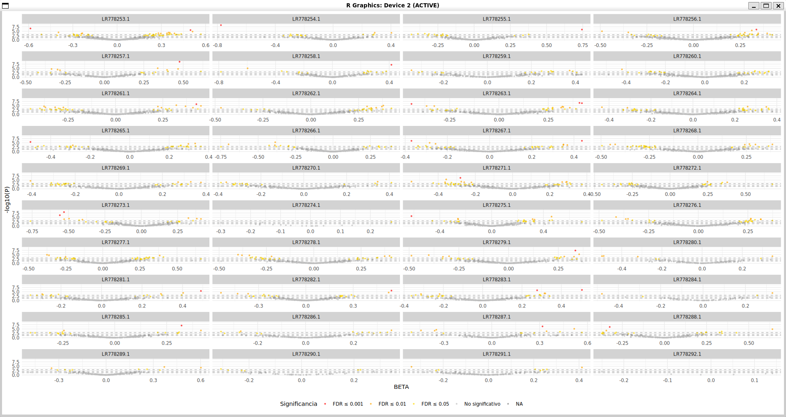

```{r}
# Comprueba si tengo los valores de q y, si no los tengo, los calcula. 
if(!"q" %in% names(gwas)) {
  library(qvalue)
  gwas$q <- qvalue(gwas$P)$qvalues
}

# Crear categorías de significancia con los diferentes intervalos. 
gwas$sig_cat <- cut(gwas$q, 
                    breaks = c(-Inf, 0.001, 0.01, 0.05, Inf),
                    labels = c("FDR ≤ 0.001", "FDR ≤ 0.01", 
                               "FDR ≤ 0.05", "No significativo"))

# Crea el gráfico de tipo volcán. 
ggplot(gwas, aes(x = BETA, y = -log10(P), color = sig_cat)) +
  geom_point(alpha = 0.6, size = 0.8) +
  facet_wrap(~CHROM, scales = "free_x", ncol = 4) +
  scale_color_manual(values = c("red", "orange", "gold", "gray")) +
  geom_hline(yintercept = -log10(c(0.05, 0.01, 0.001)), 
             linetype = "dashed", alpha = 0.3) +
  labs(x = "BETA", y = "-log10(P)", color = "Significancia") +
  theme_minimal() +
  theme(legend.position = "bottom",
        strip.background = element_rect(fill = "lightgray", color = NA)
        
```

2.  El número de SNPs cuyo genotipo está significativamente asociado al fenotipo, ¿te parece elevado o bajo?

```{r}
# Comprueba si tengo el gridExtra y, si no lo tengo, lo instala. 
if(!require(gridExtra)) install.packages("gridExtra")

library(gridExtra)

# Hace las tres gráficas (p1, p2 y p3)
p1 <- ggplot(gwas, aes(x = P)) +
  geom_histogram(bins = 50, fill = "steelblue", color = "black") +
  geom_vline(xintercept = 0.05, color = "red", linetype = "dashed") +
  labs(title = "Distribución de p-valores") +
  theme_minimal()

p2 <- ggplot(gwas, aes(sample = -log10(P))) +
  stat_qq(distribution = qexp, dparams = list(rate = 1)) +
  geom_abline(intercept = 0, slope = 1, color = "red") +
  labs(title = "QQ-plot") +
  theme_minimal()

gwas$sig_label <- ifelse(gwas$q <= 0.05, "Significativo", "No significativo")
p3 <- ggplot(gwas, aes(x = factor(CHROM), fill = sig_label)) +
  geom_bar(position = "fill") +
  labs(title = "Proporción por cromosoma", 
       x = "Cromosoma", y = "Proporción", fill = "") +
  theme_minimal() +
  theme(legend.position = "bottom")

# Las pone todas juntas en un mismo jpg. 
grid.arrange(p1, p2, p3, nrow = 2, ncol = 2,
             top = "Diagnóstico de significancia")
```

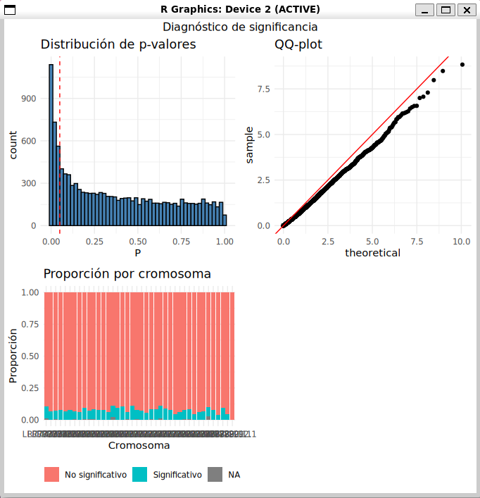

3.  Escoge un umbral y clasifica los SNPs en "positivos" y "negativos", y explora la proporción de positivos por cromosoma. ¿Puedes hacerlo sin añadir una columna al marco de datos?

```{r}
umbral <- 0.05 
library(ggplot2)

#Como hemos definido ya el umbral, no hace falta poner el valor cada vez. 
ggplot(data = subset(gwas, q <= umbral),  
       mapping = aes(x = factor(CHROM), fill = BETA > 0)) +
  geom_bar(position = "fill") +  
  scale_fill_manual(values = c("red", "blue"),
                    labels = c("Negativo", "Positivo"),
                    name = "Dirección del efecto") +
  geom_hline(yintercept = 0.5, linetype = "dashed", alpha = 0.5) +  # Línea 50%
  labs(x = "Cromosoma", 
       y = "Proporción",
       title = paste("Proporción de SNPs positivos/negativos por cromosoma\n(FDR ≤", umbral, ")")) +
  theme_minimal() +
  theme(legend.position = "bottom")
```

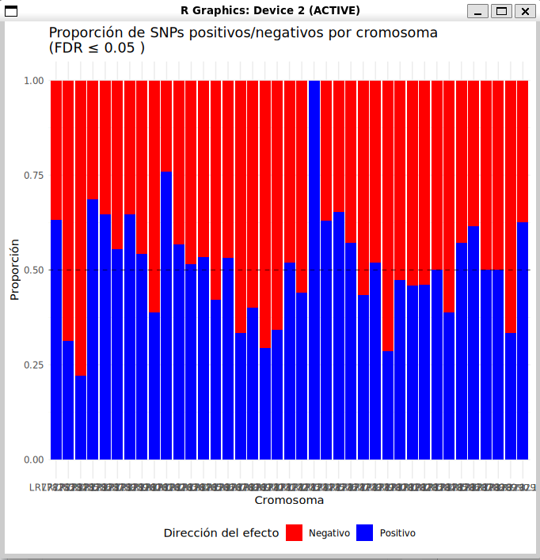
:::

# Gráfica de Manhattan

Las gráficas más características de los estudios de asociación genómica son las de Manhattan, donde la posición de los puntos a lo largo del eje horizontal se corresponde con la posición en el cromosoma, y la altura del punto es proporcional a su significación. Lo difícil es poner los cromosomas unos detrás de otros y alternar el color de los puntos en cada cromosoma. Para ello, no tenemos más remedio que añadir algunas columnas al marco de datos (o bien usar algún paquete de R específico, pero no hace falta).

```{r}
#| fig.width: 10

# Como no tenemos a mano la longitud de cada cromosoma, usaremos su posición máxima.
PosicionMaxima <- sapply(split(gwas$POS, gwas$CHROM), max)

# Al colocar los cromosomas uno detrás de otro, la coordenada global de un SNP
# es la suma de su posición en el cromosoma y las longitudes de todos los cromosomas
# anteriores. Este último término lo llamo "offset" y es 0 para el primer cromosoma,
# la longitud del primero para el segundo, etc hasta la suma de las longitudes de
# todos los cromosomas menos el último, para el último.
n <- length(PosicionMaxima)
offset <- c(0, cumsum(PosicionMaxima[-n]))
# Hay que corregir los nombre del vector "offset":
names(offset) <- names(PosicionMaxima)
# Añadimos el "offset" a cada SNP de gwas:
gwas$offset <- offset[gwas$CHROM]
gwas$GlobalPosition <- gwas$offset + gwas$POS
# Faltan los colores alternantes entre cromosomas. Una estrategia puede ser esta:
colorCromosoma <- rep(c('A', 'B'), n / 2)
names(colorCromosoma) <- names(PosicionMaxima)
gwas$color <- colorCromosoma[gwas$CHROM]

ggplot(data = gwas, mapping = aes(x = GlobalPosition, y = -log(P), color = color)) +
   geom_point() + theme(legend.position = 'none')
```

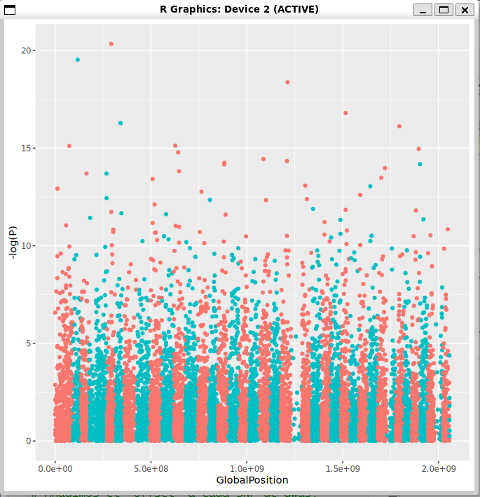

# Información de la sesión

```{r}
sessionInfo()
```
