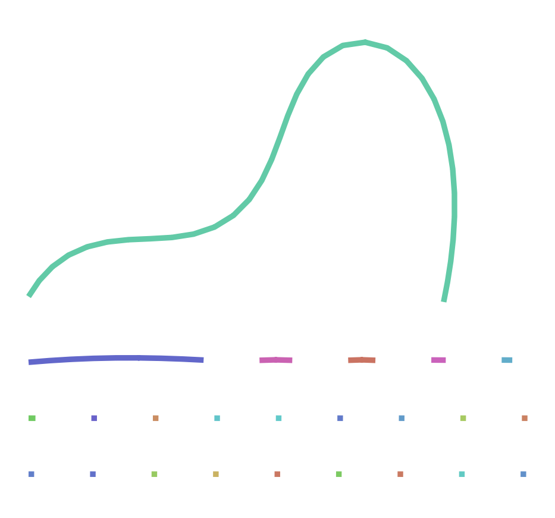

# **Práctica 10. Ensamblaje de genomas**

## **Objetivo**

Ensamblar el genoma de un eucariota diploide con lecturas de PacBio de alta fidelidad.

## **Preparación**

### **Hifiasm**

El programa `hifiasm` no está instalado en los ordenadores virtuales, y por tanto es necesario hacerlo manualmente, siguiendo los pasos siguientes en el terminal de Bash. Lo recomendable es instalarlo en una carpeta `bin` dentro de la carpeta de usuaria.

`{´´´{bash} if [ ! -d ~/bin ]; then mkdir ~/bin; fi cd ~/bin git clone https://github.com/chhylp123/hifiasm cd hifiasm make ´´´`

Una vez compilado, el ejecutable `~/bin/hifiasm/hifiasm` estará disponible, pero no en el `PATH` (donde Bash pueda encontrarlo). Para que `hifiasm` esté en el `PATH`, podemos añadir la carpeta `~/bin/hifiasm` al `PATH`. En el terminal de Bash esto se consigue con la orden `export PATH=$PATH:~/bin/hifiasm`. Pero esta orden sólo afecta el terminal en el que se ha ejecutado. Para modificar el PATH permanentemente hay que incluir esta orden en el script `~/.bashrc`. Puedes hacerlo automáticamente con la orden siguiente, pero asegúrte de ejecutarla sólo una vez:

`{´´´{bash} echo 'export PATH=$PATH:~/bin/hifiasm' >> ~/.bashrc ´´´`

A partir de entonces, cada vez que inicies el terminal, `hifiasm` estará en el `PATH`. Pero el terminal desde el cual has ejecutado la orden anterior se abrió antes de modificar `.bashrc`. Para que surta efecto sin tener que cerrar y abrir el terminal, puedes usar la orden `. ~/.bashrc`.

Hace falta instalar también otro programa, pero empecemos primero la práctica y más adelante.

## Datos

Vamos a usar lecturas HiFi generadas por Rabanal et al. ([2022](https://aulavirtual.uv.es/pluginfile.php/6018144/mod_resource/content/1/guio-es.html#ref-Rabanal2022)) de un único individuo de la planta *Arabidopsis thaliana*, ecotipo Columbia (Col-0), con la tecnología SMRT de PacBio (proyecto [PRJEB50694](https://www.ebi.ac.uk/ena/browser/view/PRJEB50694)). Los datos seleccionados son solo una parte de los originales y se encuentran en el archivo `At4.10.fa.gz` (46 Mb), disponible en el aula virtual. También está en el [espacio de disco compartido de la Universidad de Valencia](https://disco.uv.es/), dentro del grupo de bioinformática. Este espacio es directamente accesible desde los ordenadores virtuales.

En adelante supondré que el archivo está guardado en la carpeta `data` y que su *path* relativo es `../../data/At4.10.fa.gz`.

## Revisión de los datos

Los datos están en formato FASTA porque contienen sólo lecturas de alta calidad, y `hifiasm` no utiliza la información de las calidades de cada base. El archivo está comprimido. Antes de empezar el ensamblaje deberíamos tener una idea de la cantidad de datos que tenemos. Si lo necesitas, utiliza una inteligencia artificial para responder las preguntas siguientes y anota en un bloque de código las órdenes utilizadas. Puedes hacerlo con instrucciones de Bash o de R, pero R necesitará cargar en memoria el archivo entero, lo que no sería muy práctico si se tratara de un archivo 10 o 50 veces mayor.

**Ejercicio 1**

-   ¿Cuántas secuencias contiene el archivo?

`{´´´{bash} zcat ../../data/2026-04-21/At4.10.fa.gz | grep -c "^>" ´´´`

El archivo tiene 13812 secuencias.

-   ¿Qué longitudes mínima, media y máxima tienen las secuencias?

`{´´´{bash} zcat ../../data/2026-04-21/At4.10.fa.gz | awk 'BEGIN {min=1e9; max=0; sum=0; n=0}      /^>/ {if(seq!="") {len=length(seq); sum+=len; n++; if(len<min) min=len; if(len>max) max=len; seq=""}}      !/^>/ {seq=seq$0}      END {len=length(seq); sum+=len; n++; if(len<min) min=len; if(len>max) max=len;           print "Longitud mínima:", min;           print "Longitud media:", sum/n;           print "Longitud máxima:", max}'          ´´´`

La longitud mínima es de 2942, la longitud media es de 18143,6 y la longitud máxima es de 59075.

-   ¿Cuál es el número total de bases?

`{´´´{bash} zcat ../../data/2026-04-21/At4.10.fa.gz | awk '!/^>/ {sum+=length($0)} END {print "Total de bases:", sum}' ´´´`

El número total de bases es de 250599484.

-   Si se estimara que el genoma a ensamblar fuera de sólo 19 millones de bases, ¿cuál sería la cobertura esperada?

La cobertura total se calcula con el total de bases/19000000, por lo que sería 13,19.

## Ensamblaje

El programa `hifiasm` produce varios archivos de salida. Para tener la carpeta de trabajo ordenada, es recomendable crear un subcarpeta donde poder guardarlos. Si fuéramos a probar más de una estrategia de ensamblado, guardaríamos los resultados de cada intento en una carpeta diferente, que podríamos nombrar `asm1`, `asm2`, etc. Aunque sólo realicemos un ensamblaje, crearemos la carpeta `asm1` para guardar los resultados en ella.

`{´´´{bash} # Con la ejecución condicional nos ahorramos algún mensaje de error: if [ ! -d asm1 ]; then mkdir asm1; fi ´´´`

El ensamblaje de estas lecturas puede durar unos minutos. No queremos tener que ejecutarlo cada vez que compilamos el documento de Quarto. Tenemos dos opciones: o bien usamos la directriz `#| cache: true` al principio del bloque de código o bien controlamos directamente la ejecución condicional con Bash. Si usamos el método que ofrece Quarto, aparecerá una nueva carpeta que guarda resultados previos y que estaría bien incluir en el repositorio de Git. Yo prefiero usar Bash:

`{´´´{bash} if [ ! -e asm1/At4.bp.p_ctg.gfa ]; then    hifiasm -o asm1/At4 -t 2 -f 0 ../../data/2026-04-21/At4.10.fa.gz 2> asm1/hifiasm.log fi ´´´`

`{´´´{bash} HF = ~/bin/hifiasm/hifiasm $HF ´´´`

`{´´´{bash} export HF = ~/bin/hifiasm/hifiasm :$PATH $HF ´´´`

Las opciones significan lo siguiente:

-   `-o asm1/At4`: usa el prefijo `asm1/At4` para los archivos de salida.

-   `-t 2`: usa dos procesadores. Por defecto usaría uno.

-   `-f 0`: inhabilita el uso de un filtro de Bloom ([Melsted and Pritchard 2011](https://aulavirtual.uv.es/pluginfile.php/6018144/mod_resource/content/1/guio-es.html#ref-Melsted2011)) durante la corrección de errores, que ocuparía 16 Gb de memoria.

-   `../../data/At4.10.fa.gz`: archivo con los datos de partida.

-   `2> asm1/hifiasm.log`: guarda los numerosos mensajes que `hifiasm` envía al *error estándar* en un archivo `asm1/hifiasm.log`. Esto evita que esos mensajes se acumulen en el informe HTML.

**Ejercicio 2**

Consulta la ayuda de `hifiasm` (`hifiasm -h`) y contesta las preguntas siguientes:

1.  ¿Los parámetros corresponden al ensamblaje de un genoma haploide o diploide?

Por defecto, hifiasm asume un genoma diploide. Para forzar el ensamblaje haploide se necesitarían comando específicos.

2.  ¿Qué nivel de eliminación de duplicaciones hemos aplicado? (El paso de eliminar duplicaciones sirve para que las zonas de alta heterocigosidad no sean ensambladas como contigs diferentes).

Hemos aplicado el nivel 3 de eliminación de duplicaciones, que es el valor por defecto cuando no se específica.

3.  Si tuvieramos lecturas ultra-largas, ¿con qué opción o argumento añadiríamos esa información?

Con la opción - - ul seguida de los archivos de lecturas ultra-largas.

### Evaluación del resultado.

**Ejercicio 3**

Consulta la descripción de los archivos de salida que encontrarás en [este enlace](https://hifiasm.readthedocs.io/en/latest/interpreting-output.html) y contesta las preguntas siguientes:

1.  ¿Dónde están las secuencias que componen el ensamblaje?

Las secuencias están en los archivos .gfa, siendo el archivo principal asm1/At4.bp.p_ctg.gfa

2.  En los archivos `.gfa`, ¿qué son las líneas que empiezan por ‘A’?

Las lecturas que empiezan por A contienen información de las lecturas que se usaron para contriuir para cóntigo.

3.  ¿Qué información tiene los archivos `.bed`?

Estos archivos contienen las coordenadas de las regiones de baja calidad en forma BED.

4.  ¿Cuál es la cobertura media estimada de las secuencias homocigotas?

`{´´´{bash} cat asm1/hifiasm.log ´´´`

La cobertura media es de 12.

5.  ¿Y la de las heterocigotas?

No se imprime directamente, pero se puede estimar, ya que en genomas diploides heterocigotos, el pico más pequeño en el gráfico k-mers es aproximadamente la mitad del pico homocigoto. Por lo tanto, la cobertura heterocigota estimada es de 6.

Los ensamblajes primario y por haplotipos se presentan en formato [GFA](https://github.com/GFA-spec/GFA-spec/tree/master). Para extraer las secuencias en formato FASTA podemos usar el pequeño *script* siguiente, en lenguaje [AWK](https://www.gnu.org/software/gawk/manual/gawk.html), desde el terminal de Bash:

`{´´´{bash} awk '(/^S/){print ">" $2 "\n" $3}' asm1/At4.bp.p_ctg.gfa > asm1/At4.fa ´´´`

### Calidad del ensamblaje

Para obtener las estadísticas del ensamblaje utilizaremos el programa `compleasm` ([Huang and Li 2023](https://aulavirtual.uv.es/pluginfile.php/6018144/mod_resource/content/1/guio-es.html#ref-Huang2023)), que no está instalado en el ordenador virtual. Está programado en Python y depende del módulo `pandas` de Python. En WSL, este módulo o paquete probablemente pueda instalarse con `apt install python3-pandas`. Alternativamente, en los sistemas con `conda` podéis hacer `conda install pandas`. En el ordenador virtual, el módulo `pandas` ya está disponible.

`{´´´{bash} cd ~/bin wget https://github.com/huangnengCSU/compleasm/releases/download/v0.2.7/compleasm-0.2.7_x64-linux.tar.bz2 tar -jxvf compleasm-0.2.7_x64-linux.tar.bz2 ´´´`

En adelante supondré que `compleasm.py` está en `~/bin/compleasm_kit`. El programa necesita descargar la lista de genes típica del linaje al que pertenece el ensamblaje. En nuestro caso, el linaje es el de las Brassicales. La orden siguiente puede tomar más de 10 minutos.

`{´´´{bash} if [ ! -e asm1_eval/summary.txt ]; then    python3 ~/bin/compleasm_kit/compleasm.py run \       -t 2 -l brassicales -a asm1/At4.fa -o asm1_eval fi ´´´`

**Ejercicio 4**

Consulta la ayuda de `compleasm.py` y averigua qué significan los argumentos utilizados.

-   -t 2: Es el número de hilos de CPU. Le indica al programa que utilice dos procesadores en paralelo para acelerar el análisis.

-   -l brassicales: Es el orden al que pertenece Arabidopsis thaliana. El programa buscará los genes específicos de este grupo para evaluar la calidad del ensamblaje.

-   -a asm1/At4.fa: es el archivo de entrada.

-   -o asm1_eval: es el archivo de salida.

### Visualización del grafo

Desafortunadamente, no existe todavía ningún paquete de R para visualizar ensamblajes como grafos de fragmentos a partir de archivos `.gfa`. Uno de los visualizadores más populares es [bandage](https://rrwick.github.io/Bandage/), una aplicación gráfica que puede instalarse fácilmente en cualquier sistema operativo, pero que no ofrece interfaz por línea de comandos.

**Ejercicio 5**

Instala `bandage`, carga el grafo del ensamblaje realizado y genera una figura. Puedes añadir la figura al informe HTML mediante la [sitaxis siguiente](https://quarto.org/docs/authoring/figures.html):

```         

```
