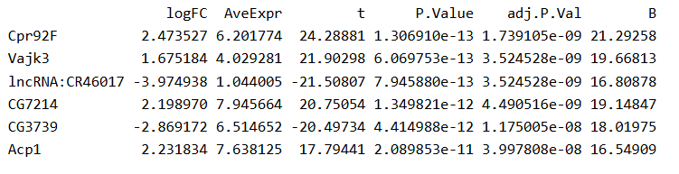

## Preparación.

Sólo necesitas instalar el paquete `DESeq2` de Bioconductor. Si lo haces en el ordenador virtual y tienes problemas de compatibilidad entre la versión de R y la de Bioconductor, sigue la estrategia siguiente:

1.  Crea una carpeta `R` en tu directorio de entrada al ordenador.

2.  Inicia una sesión de R y añade el directorio al `.libPaths`, así: `.libPaths('./R')` (suponiendo que tu directorio de trabajo es el mismo donde has creado la carpeta `R`).

3.  Actualiza la versión de `BiocManager` a la 3.22 de la siguiente manera (atención, esto lleva un par de horas): `BiocManager::install(version = '3.22', lib = './R')`.

4.  Instala el paquete `DESeq2`: `BiocManager::install('DESeq2', lib = './R')`.

## Datos

Utilizaremos las medidas de expresión génica del archivo `salmon.merged.gene_counts.tsv` que podéis descargar en [este enlace](https://informatics.fas.harvard.edu/resources/tutorials/data/salmon.merged.gene_counts.tsv) o en el aula virtual. Los datos proceden de 12 genotecas de RNA-seq de lecturas emparejadas, de muestras de *Drosophila melanogaster* de dos orígenes geográficos (Panamá y Maine) y dos tratamientos de temperatura (*low* y *high*) ([Zhao 2015](https://aulavirtual.uv.es/pluginfile.php/6039768/mod_resource/content/1/guio-es.html#ref-Zhao2015)). Hay 3 réplicas biológicas para cada combinación de región y temperatura. Si tenéis curiosidad sobre cómo se han obtenido los recuentos de lecturas por gen a partir de los archivos FASTQ, podéis consultarlo [en este enlace](https://informatics.fas.harvard.edu/resources/tutorials/differential-expression-analysis/).

Además, necesitáis el archivo `dme_elev_samples.tsv`, una tabla que indica a qué región y tratamiento pertenece cada muestra. Lo podéis descargar de [este enlace](https://informatics.fas.harvard.edu/resources/tutorials/data/dme_elev_samples.tsv) o del aula virtual.

Los dos archivos deben estar guardados en la carpeta de datos. Concretamente, están guardados en data/2026-05-05.

## Exploración de los datos.

```{r}
muestras <- read.table('../../data/2026-05-05/dme_elev_samples.tsv', header = TRUE)

genex <- read.table('../../data/2026-05-05/salmon.merged.gene_counts.tsv',
                    header = TRUE)
```

#### Ejercicio 1.

Recuerda dejar constancia en un bloque de código de cómo obtienes las respuestas.

1.  Usa la función `paste()` para añadir una columna a `muestras` que contenga la población y la temperatura unidas por `_`.

```{r}
muestras$poblacion_temp <- paste(muestras$population, muestras$temp, sep = "_")

head(muestras)
```

2.  ¿Cuál es el número total de lecturas por muestra?

```{r}
total_lecturas <- colSums(genex[, 3:ncol(genex)])
total_lecturas
```

3.  ¿Los recuentos tienen distribuciones parecidas entre muestras?

```{r}
#Nube de puntos de cada pareja de columnas. 
pairs(genex[, -c(1,2)])
```

4.  ¿Cuántos genes no se expresan en absoluto en ninguna de las muestras?

```{r}
genes_zero <- rowSums(genex[, 3:ncol(genex)]) == 0

sum(genes_zero) 
```

## Crear el objeto de clase **`DESeqDataSet`**

Para crear un objeto de clase `DESeqDataSet` necesitamos que las filas de la tabla `muestras` estén en el mismo orden que las columnas en `genex`. La función `DESeqDataSetFromMatrix()` necesita que los recuentos sean una matriz, no un marco de datos. Y en `muestras` debe haber **factores**.

```{r}
#Comprobamos que los datos están bien organizados. 
suppressMessages(library('DESeq2'))
all(names(genex)[3:14] == muestras$sample)
```

```{r}
# Pasamos la columna "sample" a nombres de fila:
row.names(muestras) <- muestras$sample
# Eliminamos la columna "sample":
muestras$sample <- NULL
# Y convertimos "population" y "temp" en factores:
muestras$population <- factor(muestras$population,
                              levels = c('maine', 'panama'))
muestras$temp       <- factor(muestras$temp,
                              levels = c('low', 'high'))
muestras
```

Aunque no hacía falta definir los niveles de los factores, lo indico porque es un buen momento para definir manualmente su orden (por defecto se ordenan alfabéticamente). El orden de los niveles determina qué nivel actúa como referencia en los contrastes estadísticos (el primero). Esto resultaría importante, por ejemplo, al comparar tratamientos respecto de un control.

Los datos de recuento deben ser números enteros y en forma de matriz

```{r}
row.names(genex) <- genex$gene_name
genex$gene_name <- NULL
genex$gene_id   <- NULL
genex <- round(as.matrix(genex))
```

```{r}
dds1 <- DESeqDataSetFromMatrix(
   countData = genex,
   colData = muestras,
   design = ~ population + temp
)
dds1
```

#### Nota

Los objetos `DESeqDataSet` pueden contener información sobre las coordenadas cromosómicas de los genes o tránscritos, si se construyen a partir de otro tipo de datos.

## Pre-filtrado.

Una fracción importante de genes no se están expresando en ningúna muestra. Aunque el filtrado no es necesario, ayuda a reducir la memoria ocupada por `dds1`:

```{r}
#Nos quedamos solo con los que se están expresando. 
keep <- rowSums(counts(dds1)) > 0
dds1 <- dds1[keep, ]
```

## Expresión diferencial.

Observa que la función `DESeq()` produce un objeto también de clase `DESeqDataSet`, pero con resultados añadidos:

```{r}
dds1 <- DESeq(dds1)
```

Qué genes están diferencialmente expresados. BaseMean: nivel de expresión medio basal. Log2FoldChange: valores negativos son aquellos donde el nivel de expresión es mayor a tempeartura baja (y al revés con los valores positivos)

```{r}
res <- results(dds1)
res
```

Por defecto, la función `results()` produce la tabla de resultados para el contraste entre el nivel último y el de referencia del último factor en la tabla que describe las muestras. En este caso, el factor es `temp`, el nivel de referencia es `low` y el otro nivel es `high`. Por tanto, los valores de `log2FoldChange` representan el logaritmo en base 2 de la relación entre niveles de expresión en muestras `high` respecto de muestras `low`.

#### Ejercicio 3.

1.  Mira la ayuda de `results()` y genera también la tabla de resultados para el contraste entre las dos regiones de procedencia de las moscas.

```{r}
help("results")

res_pob <- results(dds1, contrast = c("population", "panama", "maine"))

head(res_pob)
```

2.  Usa `summary()` sobre los resultados para ver el número de genes diferencialmente expresados entre cada par de condiciones.

```{r}
summary(res_pob)
```

Con 623 genes más expresados en Panamá y 634 genes más expresados en Maine, el total son 1257 genes diferencialmente expresados entre ambas poblaciones.

3.  ¿Cuál es la tasa de falsos positivos (FDR)?

La tasa de falsos positivos es del 10%, es decir, se espera que aproximadamente 126 genes sean falsos positivos.

## Gráficas.

```{r}
plotMA(res)
```

Los genes con niveles de expresión más bajos producen resultados más ruidosos (la varianza es mayor). La función `lfcShrink()` contrae (*shrink*) las estimaciones de los efectos (*log fold change*) para reducir el ruido y hacer el resultado más realista:

Es similar al empirical Bayes: disminuir la distribución, comprimir el log2FoldChange, asume que cada valor lo estima con error, especialmente para valores bajos. Tienes que decirle entre que par de condiciones está midiendo el log2FoldChange-

```{r}
resShrink <- lfcShrink(dds1, coef = 'temp_high_vs_low',
                       type = 'normal')
plotMA(resShrink)
```

#### Ejercicio 4.

¿Sabrías hacer una gráfica volcán?

```{r}
res_df <- as.data.frame(resShrink)

plot(res_df$log2FoldChange, -log10(res_df$pvalue), 
     pch = 20, 
     main = "Volcano plot (shrink)", 
     xlab = "log2 Fold Change", 
     ylab = "-log10 p-value")
```

## Extraer datos transformados.

Aunque los datos de entrada no deben estar normalizados y la función `DESeq()` ya tiene en cuenta las diferencias de tamaño de genoteca entre muestras y la relación entre media y varianza, puede ser útil disponer de los datos normalizados para representarlos gráficamente. Para ello podemos usar las funciones `vst()` y `assay()`:

```{r}
dds2 <- vst(dds1)
NormCounts <- assay(dds2)
```

```{r}
res <- res[! is.na(res$pvalue), ]
res <- res[order(res$log2FoldChange),]
heatmap(NormCounts[c(head(row.names(res), 100),
                     tail(row.names(res), 100)), ],
        Rowv = NA, Colv = NA)
```

#### Ejercicio 5.

¿Podrías explicar qué hace el bloque de código anterior?

```{r}
#Primero, se eliminan las filas que no tengan valor en la columna pvalue.
res <- res[! is.na(res$pvalue), ]

#Luego, se ordena las filas por el valor de log2FoldChange de menor a mayor. 
res <- res[order(res$log2FoldChange),]

#Se crea un heatmap, creando un vector con 200 nombres de genes (los 100 primeros y los 100 últimos). Se pone Rowv = NA y Colv = NA para que no se reordenen las filas y las columnas. 
heatmap(NormCounts[c(head(row.names(res), 100),
                     tail(row.names(res), 100)), ],
        Rowv = NA, Colv = NA)
```

#### Ejercicio 6.

En [este enlace](https://aulavirtual.uv.es/pluginfile.php/6039768/mod_resource/content/1/guio-es.html) analizan exactamente los mismos datos con otro paquete de R: `limma`. Una de sus conclusiones es se sobreexpresan más genes en temperatura baja que en temperatura alta. ¿Confirma tu análisis esta conclusión?

Estos son los 10 genes más diferencialmente expresados según aquel análisis entre las condiciones de baja y alta temperatura:



¿Cómo se comparan estos resultados con los tuyos?
